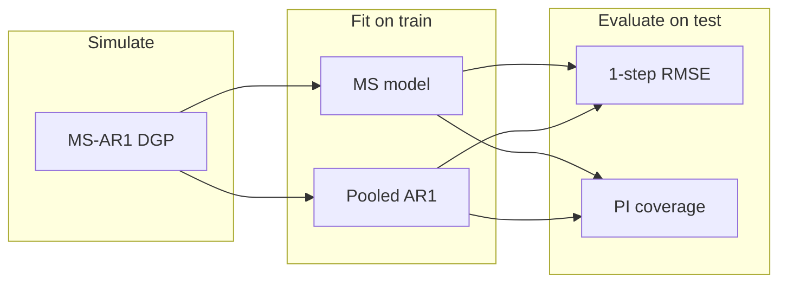

# Markov-switching AR(1) project: roadmap, maths, and code patterns

This document unpacks the supervisor’s numbered plan (Norwegian brief below) in one place: **notation**, **what to implement**, **how to evaluate**, and **Python-shaped examples**. It replaces a “comments-only” note with something you can use while writing the thesis and the code.

> **Brief (source):** Generalise to \(k\) hidden states (1); relate to ARIMAX / ARCH / GARCH (2); choose \(k\) with literature + simulation (3); on simulated data, study when MS-AR(1) beats one AR(1) using 1-step predictions and RMSE OOS (4); add 95% prediction intervals and calibration (5); compare single AR vs hard switch vs mixture for RMSE (6); derive mixture PI / calibration (7); vary sample size, parameter gap, and stickiness (a–c).

---

## Roadmap at a glance

| Item | What it means | Main outputs |
|------|----------------|--------------|
| **(1)** | Write MS-AR(1) for **general \(k\)** (filter, likelihood sketch) | Thesis section + maybe `ark.py` already general in \(k\) |
| **(2)** | **Conceptual** link: each regime = ARIMAX / ARCH / GARCH block | Text + tiny scripts: `arimax.py`, `arch1.py`, `garch.py` |
| **(3)** | **Choose \(k\)**: e.g. AIC/BIC/ICL on simulated data vs \(n\), separation | Tables/figures: chosen \(k\) vs truth |
| **(4)** | **When does MS win?** Sticky \(P_{ii}\), \(\Delta\rho\), \(\Delta\sigma\), \(n\); **OOS** 1-step RMSE | Grids + `run_prediction_experiment`-style loop |
| **(5)** | **95% PI** and **empirical coverage** (hit rate) | Coverage ≈ 0.95? |
| **(6)** | Three predictors: **pooled AR(1)** vs **hard** vs **mixture** | RMSE for each |
| **(7)** | **Mixture interval** from moments (or exact mixture quantiles) | Coverage vs (5) |
| **(a–c)** | Vary **\(n\)**, **parameter difference across states**, **dwell time** (stickiness) | Same metrics as (4)(5) |



---

## (1) Markov-switching AR(1) with \(k\) hidden states

### Process

Let \((S_t)_{t\ge 0}\) be a Markov chain on states \(\{0,\dots,k-1\}\) with transition matrix \(P\) (\(P_{ij} = \Pr(S_t=j\mid S_{t-1}=i)\), rows sum to 1). Conditional on the state at time \(t\),

\[
Y_t = \rho_{S_t}\, Y_{t-1} + \varepsilon_t, \qquad \varepsilon_t \mid S_t \sim \mathcal{N}(0,\sigma_{S_t}^2).
\]

So each state \(j\) has its own AR coefficient \(\rho_j\) and noise scale \(\sigma_j\). For \(k=2\) you recover the “two regimes” story.

### One-step prediction (conditional mean)

Given information up to \(t-1\) (at minimum \(y_{t-1}\) and a model for filtered state probabilities),

- **Regime-\(j\) conditional mean** of \(Y_t\): \(\mu_{t}^{(j)} = \rho_j\, y_{t-1}\).

The literature’s “one-step ahead” point forecast under MS-AR often uses filtered or predicted state probabilities (Hamilton-style filter). Your supervisor’s \(\rho\, y_{t-1}\) is exactly \(\mu_t^{(j)}\) **when you know you are in regime \(j\)**; under uncertainty you either **pick one \(j\)** (hard switch) or **average** (mixture).

### Likelihood sketch (forward recursion)

Let \(\alpha_t(i) = p(y_1,\dots,y_t, S_t=i)\) up to scaling. With Gaussian AR emissions \(f(y_t \mid S_t=j, y_{t-1}) = \mathcal{N}(\rho_j y_{t-1}, \sigma_j^2)\),

1. **Predict:** \(\tilde{\alpha}_t(j) = \sum_i \alpha_{t-1}(i)\, P_{ij}\).
2. **Update:** \(\alpha_t(j) \propto \tilde{\alpha}_t(j)\, f(y_t \mid j, y_{t-1})\).

Normalise \(\alpha_t\) each step for numerical stability. Log-likelihood = sum of normalisation constants. This extends verbatim from \(k=2\) to general \(k\).

### Code: simulation (already matches `ark.py`)

```python
import numpy as np

def simulate_ar1_hmm(T, P, rho, sigma, seed=None):
    rng = np.random.default_rng(seed)
    k = len(rho)
    states = np.zeros(T, dtype=int)
    y = np.zeros(T)
    states[0] = rng.integers(k)
    y[0] = rng.normal(0, sigma[states[0]])
    for t in range(1, T):
        states[t] = rng.choice(k, p=P[states[t - 1]])
        j = states[t]
        y[t] = rho[j] * y[t - 1] + rng.normal(scale=sigma[j])
    return y, states
```

---

## (2) Generalising to ARIMAX, ARCH, GARCH

Idea: **inside each hidden state \(j\)**, replace the AR(1) Gaussian emission by another model family.

| Regime model | What changes per state \(j\) | Typical package |
|--------------|-----------------------------|-----------------|
| **ARIMAX** | AR orders, exog coeffs, \(\sigma_j\) | `statsmodels` `ARIMA(..., exog=...)` |
| **ARCH** | \(\omega_j, \alpha_j\) in \(h_{t,j}^2 = \omega_j + \alpha_j e_{t-1}^2\) | `arch.arch_model` |
| **GARCH** | \(\omega_j, \alpha_j, \beta_j\) | `arch.arch_model` |

Markov structure on \(S_t\) is the same; only the **conditional density** \(f(y_t \mid S_t=j, \mathcal{F}_{t-1})\) changes. Estimation becomes heavier (more parameters, more local maxima).

**Minimal baselines without switching** (same repo):

- `code/scripts/arimax.py` — AR(1) + exogenous \(x_t\).
- `code/scripts/arch1.py` — ARCH(1) on a simulated variance process.
- `code/scripts/garch.py` — GARCH(1,1).

Those files are the “single-regime” reference implementations.

---

## (3) How many states \(k\)? Literature and a concrete simulation plan

### Common tools

- **Information criteria:** AIC / BIC from the **fitted** MS model log-likelihood, penalising parameter count (depends on \(k\): \(k\) values of \(\rho_j\), \(\sigma_j\), and \(k(k-1)\) free transition probabilities if rows are unconstrained except simplex).
- **ICL** (integrated classification likelihood): penalises poor separation of states; often mentioned for mixture/HMM order choice.
- **Likelihood-ratio tests** between nested \(k\) vs \(k+1\): theory is delicate (boundary issues); ICs are simpler for a student project.

### What to simulate

For each replicate:

1. Fix **true** \(k_{\text{true}}\) (e.g. 2), parameters, and \(P\).
2. Simulate length \(n\).
3. For each candidate \(k' = 1,2,\dots,K_{\max}\), fit (or define \(k'=1\) as **pooled AR(1)** only) and record **BIC** (and optionally AIC).
4. Record whether \(\arg\min_{k'} \mathrm{BIC} = k_{\text{true}}\).

**Cross factors:** sample size \(n\); “separation” between regimes (e.g. \(|\rho_1-\rho_2|\), \(|\sigma_1-\sigma_2|\)); stickiness (diagonals of \(P\)).

### Pseudocode: BIC over \(k\)

```python
def bic_from_nll(nll, n_params, n_obs):
    return 2 * nll + n_params * np.log(n_obs)

# Example parameter counts for MS-AR(1) with full P (simplified):
# n_params(k) = k (rho) + k (sigma) + k*(k-1) (off-diagonal logit/softmax free params)
def n_params_ms_ar1(k):
    return k + k + k * (k - 1)
```

Your `AR1_HMM` class in `ark.py` already exposes a BIC-style construction; wire a loop over `k` and many seeds.

---

## (4) When does MS-AR(1) beat one AR(1)? OOS one-step RMSE

### Truth

Data are simulated from **two-state** MS-AR(1) (or general \(k\) later).

### Competitors

1. **Pooled AR(1):** \(\hat{Y}_t = \hat{\rho}\, y_{t-1}\) with \(\hat{\rho}\) from OLS on **training** data only.
2. **MS model:** parameters \((\hat{\rho}_j, \hat{\sigma}_j, \hat{P})\) from **training** only, then filter updated on the test segment.

### Metric

Split time index into **train** / **test**. For each test time \(t\),

\[
\text{error}_t = y_t - \hat{y}_{t\mid t-1}.
\]

Report \(\text{RMSE} = \sqrt{\frac{1}{T_{\text{test}}}\sum_t \text{error}_t^2}\).

**Important:** If you filter using **true** parameters on simulated data, you measure an **oracle** upper bound on how good the model class can be. For the thesis, prefer **estimated** parameters on train, then OOS evaluation (see `run_prediction_experiment` in `ark.py`).

### Factors (overlap with a–c)

- **Stickiness:** \(P_{ii}\) large \(\Rightarrow\) longer spells in a state \(\Rightarrow\) easier to learn and predict.
- **Gap between regimes:** large \(|\rho_1-\rho_2|\) or \(|\sigma_1-\sigma_2|\) \(\Rightarrow\) MS more valuable.
- **Sample size:** more train data \(\Rightarrow\) better \(\hat{P}, \hat{\rho}_j\) and better filter.

---

## (5) Prediction intervals and calibration (95%)

### Pooled AR(1)

Estimate residual scale \(\hat{\sigma}\) on training residuals. Gaussian nominal 95% interval:

\[
\hat{y}_t \pm z_{0.975}\, \hat{\sigma}, \quad z_{0.975} \approx 1.96.
\]

**Calibration:** fraction of test points with \(y_t\) inside the interval. If the model and Gaussian assumption are right, coverage \(\approx 0.95\). Misspecification often shows up as **under-** or **over-coverage**.

### MS with state-specific \(\sigma_j\)

When you use a **hard** decision for the active regime, use that regime’s \(\sigma_j\) in the same Gaussian interval around the point forecast.

### Why this matters

Point RMSE can favour one method; **coverage** tells you whether uncertainty bands are honest—especially relevant when comparing a **mixture** (next section) to a **hard** switch.

---

## (6) Three one-step predictors (supervisor’s comparison)

Let \(p_{t-1}(j) = \Pr(S_{t-1}=j \mid y_{1:t-1})\) from the **filtered** distribution at \(t-1\) (or use **predicted** \( \Pr(S_t=j\mid y_{1:t-1})\); be consistent in the write-up). Conditional means \(\mu_t^{(j)} = \rho_j y_{t-1}\).

### A. Pooled AR(1)

\[
\hat{y}_t^{\mathrm{pool}} = \hat{\rho}\, y_{t-1}.
\]

### B. Hard switch (“\(p>0.5\)” for two states)

For **\(k=2\)**, choosing the state with **largest** filtered probability is equivalent to “state 1 if \(p_{t-1}(1) > 0.5\)” unless \(p_{t-1}(1)=0.5\) exactly.

\[
j^\* = \arg\max_j p_{t-1}(j), \qquad \hat{y}_t^{\mathrm{hard}} = \rho_{j^\*} y_{t-1}.
\]

For **\(k>2\)**, “\(p>0.5\)” is **not** the same as argmax; use argmax or define a threshold rule explicitly.

### C. Mixture (weighted)

\[
\hat{y}_t^{\mathrm{mix}} = \sum_{j=0}^{k-1} p_{t-1}(j)\, \rho_j\, y_{t-1}.
\]

This matches the supervisor’s \(p \hat{y}^1 + (1-p)\hat{y}^2\) when \(k=2\) and \(p = p_{t-1}(1)\).

### Code pattern (conceptual)

```python
import numpy as np

def preds_one_step(y_prev, rho_ms, p_filter, rho_pool_hat):
    """rho_ms: (k,) regime AR coeffs; p_filter: (k,) filtered probs at t-1; rho_pool_hat: scalar OLS AR(1)."""
    mu = rho_ms * y_prev
    y_pool = rho_pool_hat * y_prev
    j = int(np.argmax(p_filter))
    y_hard = mu[j]
    y_mix = np.sum(p_filter * mu)
    return y_pool, y_hard, y_mix
```

---

## (7) Prediction interval for the **mixture** forecast

Conditional on information at \(t-1\), the **predictive** distribution of \(Y_t\) is a **Gaussian mixture** (for AR(1) MS with Gaussian noise): with probability \(p_{t-1}(j)\),

\[
Y_t \mid (S_{t-1}\text{ implicit in weights}) \sim \mathcal{N}(\mu_t^{(j)}, \sigma_j^2), \quad \mu_t^{(j)} = \rho_j y_{t-1}.
\]

### Exact mean and variance (moment-matched interval)

Let \(p_j = p_{t-1}(j)\), \(\mu_j = \mu_t^{(j)}\).

\[
\mathbb{E}[Y_t] = \sum_j p_j \mu_j = \hat{y}_t^{\mathrm{mix}}.
\]

**Law of total variance:**

\[
\mathrm{Var}(Y_t) = \sum_j p_j \sigma_j^2 + \sum_j p_j (\mu_j - \mathbb{E}[Y_t])^2
= \sum_j p_j (\sigma_j^2 + \mu_j^2) - \Big(\sum_j p_j \mu_j\Big)^2.
\]

A **simple** nominal 95% interval uses normality:

\[
\hat{y}_t^{\mathrm{mix}} \pm 1.96 \sqrt{\mathrm{Var}(Y_t)}.
\]

**Caveat for the thesis:** the true predictive is **not** Gaussian unless one state dominates; this interval is a **Gaussian approximation**. You can report coverage anyway and mention that exact intervals would use mixture quantiles (numerical).

### Code: mixture variance and Gaussian PI

```python
import numpy as np

def mix_mean_var(p, rho, sigma, y_prev):
    mu = rho * y_prev
    m = np.sum(p * mu)
    v = np.sum(p * (sigma**2 + mu**2)) - m**2
    return m, max(v, 1e-12)

z = 1.96
m, v = mix_mean_var(p, rho, sigma, y_prev)
lo, hi = m - z * np.sqrt(v), m + z * np.sqrt(v)
```

---

## Experiment axes (a), (b), (c)

| Axis | Knob | Effect |
|------|------|--------|
| **(a)** Sample size | Train length \(n\) (and optionally test length) | More data → better estimates, filter, RMSE |
| **(b)** Parameter gap | \(|\rho_1-\rho_2|\), \(|\sigma_1-\sigma_2|\) | Larger gap → MS easier to learn vs pooled model |
| **(c)** Dwell / stickiness | \(P_{ii}\) (two-state symmetric case: `[[s,1-s],[1-s,s]]`) | Higher \(P_{ii}\) → longer spells, clearer regimes |

A practical grid: fix two axes, sweep the third, and plot **RMSE** and **coverage** for pooled vs hard vs mix.

---

## Where this lives in the repo

| Piece | Location |
|-------|----------|
| MS-AR(1) simulate + fit + OOS experiment | `code/scripts/ark.py` (`simulate_ar1_hmm`, `AR1_HMM`, `run_prediction_experiment`) |
| Exploratory notebook | `code/notebooks/ark.ipynb` |
| Plain ARIMAX / ARCH / GARCH demos | `code/scripts/arimax.py`, `arch1.py`, `garch.py` |

---

## Appendix: minimal baseline scripts (ARIMAX, ARCH, GARCH)

These are **single-regime** reference DGPs + fits.

### Vocabulary

- **DGP:** simulation recipe with chosen parameters.
- **Fit:** MLE (or QMLE) in statsmodels / arch on the simulated series.

### `arimax.py`

- Simulates \(y_t = p y_{t-1} + b x_t + e_t\), fits `ARIMA(1,0,0)` with `exog` and `trend="c"` (intercept).
- First observation initialisation avoids needing \(y_{-1}\).

### `arch1.py`

- ARCH(1): \(h_t^2 = w + a e_{t-1}^2\), \(e_t = h_t z_t\). Starts \(h^2\) at unconditional variance \(w/(1-a)\).
- File name **`arch1.py`** so `import arch` resolves to the **package**, not a local `arch.py`.
- `y = e * 100` scales data so `omega` is not tiny in optimisation; interpret fitted `omega` on that scale.

### `garch.py`

- GARCH(1,1): \(h_t^2 = w + a e_{t-1}^2 + b h_{t-1}^2\). Loop reuses `h2` on the RHS as \(h_{t-1}^2\) before overwrite.
- Stationarity: \(a + b < 1\). Initial \(h^2 = w/(1-a-b)\).

### Sanity checks

- ARIMAX: fitted AR and exog coeffs near \((p,b)\); `sigma2` near noise variance.
- ARCH/GARCH: \(\alpha,\beta\) near simulated \(a,b\); `omega` on the **scaled** \(y\) scale.

---

## Literature pointers (for the thesis text)

- Hamilton (1989, *Econometrica*): Markov switching, filter, EM-style estimation — standard reference for MS models in econometrics.
- Regime-switching AR and state inference: filtered vs smoothed probabilities.
- Order choice: AIC/BIC for finite mixture/HMM; ICL for clearer separation penalty (cite from your course reading list).

Use your course bibliography for exact editions and page numbers.
